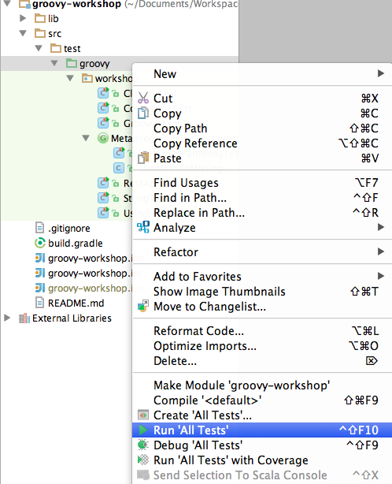

# Groovy Workshop

In our opinion you only learn languages if you play with them. Only consuming PowerPoint presentations isn't enough.
So this workshop will allow you to learn Groovy syntax and concepts by making testcases pass. 

Please note that this workshop is heavily inspired by the [Groovy Koans](http://groovykoans.org/),
but provides a slightly different structure and scope.

## Presentation

The (german) slides for this workshop are available here: [ Presentation ](/groovy-workshop-hma-mtre-2014-08-23.pdf)

## Installation

### 1. Install Gradle
- Download [Gradle 2.0](https://services.gradle.org/distributions/gradle-2.0-bin.zip)
- Extract that folder (e.g to ~/sdk/gradle) and make sure that the `bin` folder it is in your `PATH` environment variable.

    export PATH=${PATH}:~/sdk/gradle/bin

### 2. Install IntelliJ
- Download and install [IntelliJ 13 CE](http://www.jetbrains.com/idea/download/)

Groovy 2.3.3 already comes as jar-file in the `/lib` folder

### 3. Remove solutions
Before you start the workshop please remove the solutions in the code.
Just execute

    gradle removeSolutions
    
The solutions for the tests are copied into `output/solutions`.

### 4. Execute tests
In order to start the tests you may use gradle.

    gradle test

In IntelliJ you can right click on the `src/test` folder and choose `Run All Tests`.

### 5. Fix tests
Make the tests pass.

